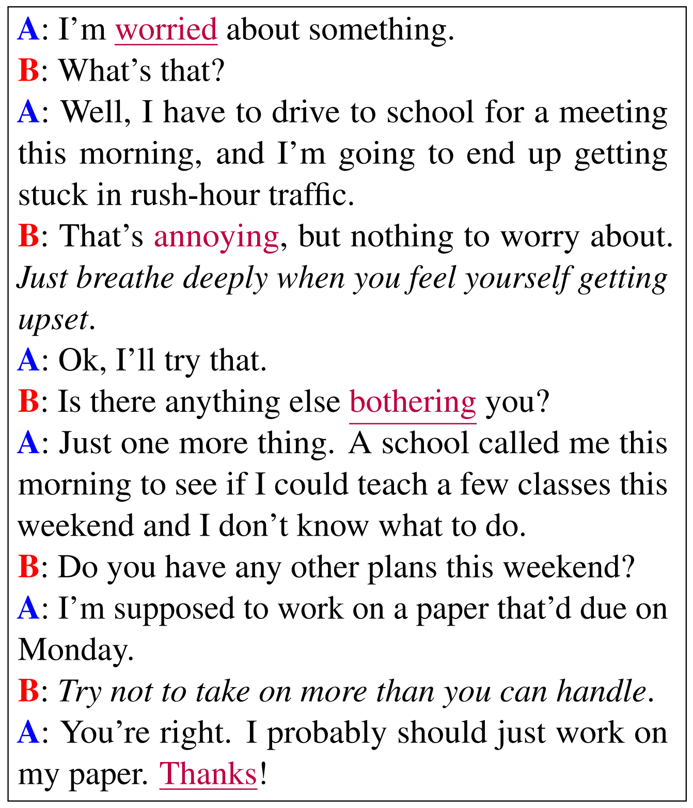
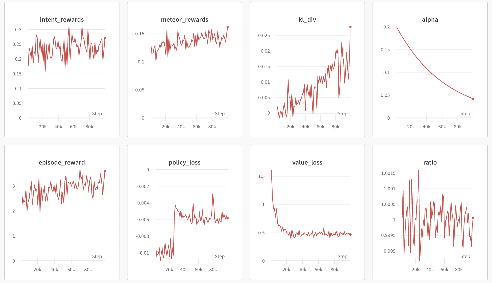

Train Natural Language Dialogue Task
======================================

In this section, we will introduce how to import `Hugging Face <https://huggingface.co/>`_  **models** and **datasets** into OpenRL,
as well as how to use a **custom reward model** and **customize the output** of wandb through a natural language dialogue task ( `DailyDialog <https://arxiv.org/abs/1710.03957>`_ ).

Introduction to DailyDialog
-----------------------------

`DailyDialog <https://arxiv.org/abs/1710.03957>`_ is a multi-turn dialogue dataset, which contains a total of 13,000 dialogues.

The following image shows an example dialogue from DailyDialog:

In the past, supervised learning was commonly used for training natural language tasks,
but recent research has shown that reinforcement learning can also be used to train language models,
and can significantly improve model performance (see [`1 <https://arxiv.org/abs/2203.02155>`_][`2 <https://arxiv.org/abs/2210.01241>`_][`3 <https://openai.com/research/gpt-4>`_]).

Next, we will provide a detailed introduction on how to use OpenRL to train natural language tasks.

Creat Environment and Load Dataset
------------------------------------

Training for natural language tasks involves the use of some additional packages.
Users can install these packages using the following command:

.. code-block:: bash

    pip install "openrl[nlp]"

Similar to the tutorial on multi-agent RL (`MPE <./multi_agent_RL.html>`_ ),
we first need to write a ``train_ppo.py`` file and include the following training code:

.. code-block:: python

    # train_ppo.py
    from openrl.envs.common import make
    from openrl.modules.common import PPONet as Net
    from openrl.runners.common import PPOAgent as Agent
    from openrl.configs.config import create_config_parser
    def train():
        # Add code to read the configuration file.
        cfg_parser = create_config_parser()
        cfg = cfg_parser.parse_args()
        # Create NLP environment.
        env = make("daily_dialog",env_num=2,asynchronous=True,cfg=cfg)
        # Create neural network.
        net = Net(env, cfg=cfg, device="cuda")
        # Create training agent.
        agent = Agent(net)
        # Begin training.
        agent.train(total_time_steps=100000)
        # Save the trained agent.
        agent.save("./ppo_agent/")
    if __name__ == "__main__":
        train()

Then, we can create a configuration file named ``nlp_ppo.yaml`` and add the following content:

.. code-block:: yaml

    # nlp_ppo.yaml
    env: # environment parameters
        args: {
            "tokenizer_path": gpt2, # path to load tokenizer
            "data_path": daily_dialog # dataset name or path
        } 
    seed: 0 # set seed
    lr: 1e-6 # set learning rate of policy model
    critic_lr: 1e-6 # set learning rate of critic model
    episode_length: 20 # set the length of each episode
    use_recurrent_policy: true

From the above configuration file,
Training an NLP task requires additional settings for the environment parameter ``env.args``.
The ``tokenizer_path`` in the environment parameters is used to specify the Hugging Face name or local path for loading text encoders.
In addition, ``data_path`` in the environment parameters can be set to either a Hugging Face dataset name or a local dataset path.

Train with Hugging Face's models.
-----------------------------------

In OpenRL, we can use models from Hugging Face for training.
To load a model from Hugging Face, we first need to add the following content in the configuration file ``nlp_ppo.yaml`` :

.. code-block:: yaml

    # nlp_ppo.yaml
    model_path: rajkumarrrk/gpt2-fine-tuned-on-daily-dialog # pre-trained model name or path
    use_share_model: true
    ppo_epoch: 5 # ppo iteration times

    env: # environment parameters
        args: {
            "tokenizer_path": gpt2, # path to load tokenizer
            "data_path": daily_dialog # dataset name or path
        } 
    lr: 1e-6 # set learning rate of policy model
    critic_lr: 1e-6 # set learning rate of critic model
    episode_length: 128 # set the length of each episode
    num_mini_batch: 20

Then you need to add the following code in ``train_ppo.py`` :

.. code-block:: python

    # train_ppo.py
    from openrl.envs.common import make
    from openrl.modules.common import PPONet as Net
    from openrl.runners.common import PPOAgent as Agent
    from openrl.configs.config import create_config_parser
    from openrl.modules.networks.policy_value_network_gpt import (
        PolicyValueNetworkGPT as PolicyValueNetwork,
    )
    def train():
        # Add code to read the configuration file.
        cfg_parser = create_config_parser()
        cfg = cfg_parser.parse_args()
        # Create NLP environment.
        env = make("daily_dialog",env_num=2,asynchronous=True,cfg=cfg)
        # Create neural network.
        model_dict = {"model": PolicyValueNetwork}
        net = Net(env, cfg=cfg, model_dict=model_dict)
        # Create training agent.
        agent = Agent(net)
        # Begin training.
        agent.train(total_time_steps=100000)
        # Save the trained agent.
        agent.save("./ppo_agent/")
    if __name__ == "__main__":
        train()

By making the simple modifications outlined above, users can train using pre-trained models on Hugging Face.

.. note::

    In the above example, we used the model ``PolicyValueNetworkGPT`` .
    OpenRL also supports user-defined models (such as a custom model named ``CustomPolicyValueNetwork`` ),
    which can be passed into the training network in the following way:

     .. code-block:: python

         model_dict = {"model": CustomPolicyValueNetwork}
         net = Net(env, model_dict=model_dict)

    If you want to separately implement the policy network and value network,
    you can achieve it through the following methods:

     .. code-block:: python

         model_dict = {
             "policy": CustomPolicyNetwork,
             "critic": CustomValueNetwork,
         }
         net = Net(env, model_dict=model_dict)

    The implementation method of custom models can refer to `PolicyValueNetworkGPT <https://github.com/OpenRL-Lab/openrl/blob/main/openrl/modules/networks/policy_value_network_gpt.py>`_、`PolicyNetwork <https://github.com/OpenRL-Lab/openrl/blob/main/openrl/modules/networks/policy_network.py>`_ and `ValueNetwork <https://github.com/OpenRL-Lab/openrl/blob/main/openrl/modules/networks/value_network.py>`_ 。

Use Reward Model
------------------

Usually, the datasets for natural language tasks do not include reward information.
Therefore, if reinforcement learning is used to train a natural language task, an additional reward model needs to be used to generate rewards.

In this DailyDialog task, we will use a composite reward model that includes the following three parts:

- **Intent Reward**：When the generated text by the agent is close to the expected intent, the agent can receive higher rewards.
- **METEOR Metric Reward**： `METEOR <https://en.wikipedia.org/wiki/METEOR>`_ is a metric used to evaluate text generation quality and can be used to measure how similar generated texts are compared with expected ones. We use this metric as feedback for rewards given to agents in order to optimize their text generation performance.
- **KL Divergence Reward**：This reward is used to limit how much text generated by agents deviates from pre-trained models and prevent issues of **reward hacking**.

Our final reward is a weighted sum of these three rewards where the coefficient of **KL Divergence Reward** changes dynamically based on its value.

To use this reward model in OpenRL, users do not need to modify training code but only need add ``reward_class`` parameter in ``nlp_ppo.yaml`` file.

.. code-block:: yaml

    # nlp_ppo.yaml
    reward_class:
        id: NLPReward # reward model name
        args: {
            # The name or path of the model used for intent recognition.
            "intent_model": rajkumarrrk/roberta-daily-dialog-intent-classifier,
            # The name or path of the pre-trained model used for calculating KL divergence.
            "ref_model": rajkumarrrk/gpt2-fine-tuned-on-daily-dialog,
        }

    model_path: rajkumarrrk/gpt2-fine-tuned-on-daily-dialog # pre-trained model name or path
    use_share_model: true
    ppo_epoch: 5 # ppo iteration times
    env: # environment parameters
        args: {
            "tokenizer_path": gpt2, # path to load tokenizer
            "data_path": daily_dialog # dataset name or path
        } 
    lr: 1e-6 # set learning rate of policy model
    critic_lr: 1e-6 # set learning rate of critic model
    episode_length: 128 # set the length of each episode
    num_mini_batch: 20

.. note::

    OpenRL supports users to use custom reward models.
    First, the user needs to write a custom reward model (which needs to inherit from the `BaseReward <https://github.com/OpenRL-Lab/openrl/blob/main/openrl/rewards/base_reward.py>`_ class).
    Then, the user needs to register the custom reward model by adding the following code in ``train_ppo.py`` :

    .. code-block:: python

        # train_ppo.py
        from openrl.rewards.nlp_reward import CustomReward
        from openrl.rewards import RewardFactory
        RewardFactory.register("CustomReward", CustomReward)

    Finally, the user needs to fill in their custom reward model in ``nlp_ppo.yaml`` :

    .. code-block:: yaml

        reward_class:
            id: "CustomReward" # custom reward model name
            args: {} # the parameters that may be used in the custom reward model

Customize wandb Output
-----------------------

OpenRL also supports user-defined output content for wandb or tensorboard.
For example, during the training process of this task, we also need to output information on various types of rewards
and KL divergence coefficients.
Users can add the ``vec_info_class`` parameter in the ``nlp_ppo.yaml`` file to achieve this:

.. code-block:: yaml

    # nlp_ppo.yaml
    vec_info_class:
        id: "NLPVecInfo" # Call the NLPVecInfo class to print information about rewards in the NLP task.
    # set wandb information
    wandb_entity: openrl # This is used to specify the wandb team name. Please replace openrl with your own team name.
    experiment_name: train_nlp # This is used to specify the name of the experiment.
    run_dir: ./run_results/ # This is used to specify the path for saving experimental data.
    log_interval: 1 # This is used to specify how often to upload wandb data every few episodes.
    # Fill in other parameters yourself...

After modifying the configuration file, enable wandb in the ``train_ppo.py`` file:

.. code-block:: python

    # train_ppo.py
    agent.train(total_time_steps=100000, use_wandb=True)

Then execute 'python train_ppo.py --config nlp_ppo.yaml', after a while, you can see the following output in wandb:

From the above figure, we can see that wandb has outputted information on various types of rewards and the KL divergence coefficient.

If the user needs to output other information, they can also refer to the `NLPVecInfo <https://github.com/OpenRL-Lab/openrl/blob/main/openrl/envs/vec_env/wrappers/vec_info.py>`_ class
and `VecInfo <https://github.com/OpenRL-Lab/openrl/blob/main/openrl/envs/vec_env/wrappers/vec_info.py>`_ class to implement their own ``CustomVecInfo`` class.
Then, it is necessary to register the custom ``CustomVecInfo`` class in ``train_ppo.py`` :

.. code-block:: python

    # train_ppo.py
    # Register the CustomVecInfo class.
    VecInfoFactory.register("CustomVecInfo", CustomVecInfo)

Finally, just fill in the ``CustomVecInfo`` class in the ``nlp_ppo.yaml`` file:

.. code-block:: yaml

    # nlp_ppo.yaml
    vec_info_class:
        id: "CustomVecInfo" # Call the CustomVecInfo class to output custom information.

Accelerate training with Automatic Mixed Precision
---------------------------------------------------

OpenRL also provides a feature to enable automatic mixed-precision training in one step.
Users only need to add the following parameters in the configuration file:

.. code-block:: yaml

    # nlp_ppo.yaml
    use_amp: true # Enable automatic mixed precision training.

.. tip::

    Users can find sample code for training nlp tasks in `train_ppo.py <https://github.com/OpenRL-Lab/openrl/blob/main/examples/nlp/train_ppo.py>`_ .
    Find the parameters for training nlp tasks in `nlp_ppo.yaml <https://github.com/OpenRL-Lab/openrl/blob/main/examples/nlp/nlp_ppo.yaml>`_ .
    Users can execute python train_ppo.py --config nlp_ppo.yaml to train the conversation task.

Accelerate training with DeepSpeed
---------------------------------------------------

OpenRL also provides a feature to enable DeepSpeed training in one step.
Users first need to add two configuration file:

.. code-block:: yaml

    # ds_config.yaml
    {
      "train_batch_size": 32, # train_batch_size = episode_length * env_num / num_mini_batch
      "train_micro_batch_size_per_gpu": 16, # train_micro_batch_size_per_gpu = train_batch_size / num_gpu
      "steps_per_print": 10,
      "zero_optimization": {
          "stage": 2, # default to use Zero2
          "reduce_bucket_size": 5e7,
          "allgather_bucket_size": 5e7
      },
      "fp16": {"enabled": false, "loss_scale_window": 100} # whether to use fp16
    }
    # eval_ds_config.yaml
    {
      "train_batch_size": 32,
      "train_micro_batch_size_per_gpu": 16,
      "steps_per_print": 10,
      "zero_optimization": {
        "stage": 0, # default to use cpu offload for ref_model and reward model
        "offload_param": {"device": "cpu"}
    },
      "fp16": {"enabled": false} # whether to use fp16
    }

Next enable DeepSpeed in `nlp_ppo_ds.yaml <https://github.com/OpenRL-Lab/openrl/blob/main/examples/nlp/nlp_ppo_ds.yaml>`_.

.. code-block:: yaml

    use_deepspeed: true
    use_fp16: false
    use_offload: false
    deepspeed_config: ds_config.json
    reward_class: 
      id: "NLPReward"
      args: { 
        "use_deepspeed": true,
        "ref_ds_config": "eval_ds_config.json", # use eval ds config for ref model
        "ref_model": "rajkumarrrk/gpt2-fine-tuned-on-daily-dialog",
        "intent_ds_config": "eval_ds_config.json", # use eval ds config for reward model
        "intent_model": "rajkumarrrk/roberta-daily-dialog-intent-classifier",
      }

.. tip::

    ``Episode_length`` and ``num_mini_batch`` can be found in `nlp_ppo_ds.yaml <https://github.com/OpenRL-Lab/openrl/blob/main/examples/nlp/nlp_ppo_ds.yaml>`_; 
    ``env_num`` can be found in `train_ppo.py <https://github.com/OpenRL-Lab/openrl/blob/main/examples/nlp/train_ppo.py>`_; 
    please ensure that all parameters meet the following relationship: ``train_batch_size = episode_length * env_num / num_mini_batch``. 

Finally, please run the command

.. code-block:: yaml

    deepspeed train_ppo.py --config nlp_ppo_ds.yaml

Training results of OpenRL
---------------------------

The table below shows the results of training the dialogue task using OpenRL.
The results indicate that after training with reinforcement learning, all model indicators have improved.
In addition, from the table below, it can be seen that compared to `RL4LMs <https://github.com/allenai/RL4LMs>`_ ,
OpenRL has a faster training speed (on the same server with NVIDIA 3090 GPUs, the speed is increased by 17.2%), and better final performance:

=================== ================ ================ ================ =============== ================ ================ ==================
\                   FPS(Speed)       Rouge-1          Rouge-Lsum       Meteor          SacreBLEU        Intent Reward    Mean Output Length
=================== ================ ================ ================ =============== ================ ================ ==================
Supervised Learning None             0.164            0.137            0.234           0.063            0.427            18.95
RL4LMs              11.26            0.169            0.144            0.198           0.071            **0.455**        18.83
OpenRL              **13.20(+17%)**  **0.181(+10%)**  **0.153(+12%)**  **0.292(+25%)** **0.090(+43%)**  0.435(+1.9%)     18.69
=================== ================ ================ ================ =============== ================ ================ ==================

The table below shows that compared to OpenRL with Data-Parallel, OpenRL with DeepSpeed has a faster training speed:

=============================== ================ ================ ========================= =============== ================================ 
\                               FPS(Speed)       Number of GPUs   Memory Usage per GPU(MB)  GPU Type        Train Micro Batch Size per GPU
=============================== ================ ================ ========================= =============== ================================ 
DeepSpeed w/ GPT-2-small        **5.11(+30%)**   2                13537                     RTX 3090        8
Data-Parallel w/ GPT-2-small    3.94             2                7207                      RTX 3090        8
=============================== ================ ================ ========================= =============== ================================ 
DeepSpeed w/ OPT-1.3B           **7.09(+35%)**   4                35360                     NVIDIA A100     8
Data-Parallel w/ OPT-1.3B       5.25             4                15854                     NVIDIA A100     8
=============================== ================ ================ ========================= =============== ================================ 

Chat with Trained Agent
------------------------

For a trained agent, users can easily engage in conversation through the ``agent.chat()`` function:

.. code-block:: python

    # chat.py
    from openrl.runners.common import ChatAgent as Agent
    def chat():
        agent = Agent.load("./ppo_agent", tokenizer="gpt2",)
        history = []
        print("Welcome to OpenRL!")
        while True:
            input_text = input("> User: ")
            if input_text == "quit":
                break
            elif input_text == "reset":
                history = []
                print("Welcome to OpenRL!")
                continue
            response = agent.chat(input_text, history)
            print(f"> OpenRL Agent: {response}")
            history.append(input_text)
            history.append(response)
    if __name__ == "__main__":
        chat()

Execute **python chat.py** to start a conversation with the trained agent:

.. tip::

    Users can find the sample code for this section in `chat.py <https://github.com/OpenRL-Lab/openrl/blob/main/examples/nlp/chat.py>`_ .
    In addition, we also provide an example of chatting with the `ChatGLM-6B <https://github.com/THUDM/ChatGLM-6B>`_ model in `chat_6b.py <https://github.com/OpenRL-Lab/openrl/blob/main/examples/nlp/chat_6b.py>`_.

.. image::
    images/chat.gif
    :width: 800
    :align: center

